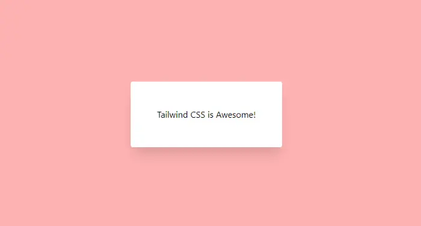

> Find the full source code for this article in [this github repository](https://github.com/talohana/angular-tailwind-example)

Tailwind CSS is a low-level CSS framework that contains bite-sized utility classes that makes
your components consistent and help you avoid opinionated styles.

If you’ve been using Angular, you probably came across one of the
popular UI libraries such as [Material UI](https://material.angular.io/), [PrimeNG](https://www.primefaces.org/primeng/) and more.

Tailwind CSS is another option to style your Angular application that is a little bit different than the mentioned libraries.

---

## So what is Tailwind CSS

Tailwind CSS is a utility-first library, which basically means that instead of providing
you with fully implemented components such as [mat-button](https://material.angular.io/components/button/overview)
or a [p-calendar](https://www.primefaces.org/primeng/showcase/#/calendar),
it provides you with many bite-sized classes to that reflect almost every css property you can think of.
Its’ biggest advantage is it makes your components consistent, and removes any opinionated style off the table.

https://codepen.io/xtalo/pen/Vwevaze

With this example we only scratched the surface, Tailwind also provides you with utility classes to handle responsive design, fluid containers, transitions and much more.

## Integrating Tailwind and Angular

Let’s start by creating Angular project we can play with, by opening the command line and running

```shell
npx @angular/cli new cli-example --style=scss --minimal=true --interactive=false
```

Next, we need to install a few dev dependencies

```shell
npm i -D tailwindcss postcss-import postcss-loader postcss-scss @fullhuman/postcss-purgecss @angular-builders/custom-webpack
```

- [tailwindcss](https://www.npmjs.com/package/tailwindcss) — contains all tailwind styles and utilities
- [postcss-import](https://www.npmjs.com/package/postcss-import) — a PostCSS plugin that lets us use @import statements
- [postcss-scss](https://www.npmjs.com/package/postcss-scss) — lets us use scss syntax with PostCSS
- [postcss-loader](https://www.npmjs.com/package/postcss-loader) — a webpack loader that lets us process CSS with PostCSS
- [@fullhuman/postcss-purgecss](https://www.npmjs.com/package/@fullhuman/postcss-purgecss) — PurgeCSS lets us remove unused CSS, this package is a PostCSS plugin to use with PostCSS
- [@angular-builders/custom-webpack](https://www.npmjs.com/package/@angular-builders/custom-webpack) — a library which lets us override the default webpack config shipped with angular-cli

Now we are going to configure angular’s webpack, let’s start by creating 2 webpack config files at our project root directory

```js
// webpack.config.dev.js
module.exports = {
  module: {
    rules: [
      {
        test: /\.scss$/,
        loader: 'postcss-loader',
        options: {
          ident: 'postcss',
          syntax: 'postcss-scss',
          plugins: () => [
            require('postcss-import'),
            require('tailwindcss'),
            require('autoprefixer'),
          ],
        },
      },
    ],
  },
};
```

```js
// webpack.config.prod.js
module.exports = {
  module: {
    rules: [
      {
        test: /\.scss$/,
        loader: 'postcss-loader',
        options: {
          ident: 'postcss',
          syntax: 'postcss-scss',
          plugins: () => [
            require('postcss-import'),
            require('tailwindcss'),
            require('autoprefixer'),
            require('@fullhuman/postcss-purgecss')({
              content: ['./src/**/*.html', './src/**/*.ts'],
              defaultExtractor: content =>
                content.match(/[A-Za-z0-9-_:/]+/g) || [],
            }),
          ],
        },
      },
    ],
  },
};
```

Next, we need to tell angular to use these config files, we do so by updating angular.json file architect.builder and architect.serve properties.

We set the builder field to use @angular-builders/custom-webpack:browser in architect.build and @angular-builders/custom-webpack:dev-server
in architect.serve.
Also, under options we set customWebpackConfig to point to our configs.
Note, we need to pass different configuration files in production mode.

```json
{
      ...
      "architect": {
        "build": {
          "builder": "@angular-builders/custom-webpack:browser",
          "options": {
            "customWebpackConfig": {
              "path": "./webpack.config.dev.js"
            },
            "outputPath": "dist/angular-tailwind-example",
            "index": "src/index.html",
            "main": "src/main.ts",
            "polyfills": "src/polyfills.ts",
            "tsConfig": "tsconfig.app.json",
            "aot": true,
            "assets": ["src/favicon.ico", "src/assets"],
            "styles": ["src/styles.scss"],
            "scripts": []
          },
          "configurations": {
            "production": {
              "customWebpackConfig": {
                "path": "./webpack.config.prod.js"
              },
              "fileReplacements": [
                {
                  "replace": "src/environments/environment.ts",
                  "with": "src/environments/environment.prod.ts"
                }
              ],
              "optimization": true,
              "outputHashing": "all",
              "sourceMap": false,
              "extractCss": true,
              "namedChunks": false,
              "extractLicenses": true,
              "vendorChunk": false,
              "buildOptimizer": true,
              "budgets": [
                {
                  "type": "initial",
                  "maximumWarning": "2mb",
                  "maximumError": "5mb"
                },
                {
                  "type": "anyComponentStyle",
                  "maximumWarning": "6kb",
                  "maximumError": "10kb"
                }
              ]
            }
          }
        },
        "serve": {
          "builder": "@angular-builders/custom-webpack:dev-server",
          "options": {
            "browserTarget": "angular-tailwind-example:build"
          },
          "configurations": {
            "production": {
              "browserTarget": "angular-tailwind-example:build:production"
            }
          }
        },
        "extract-i18n": {
          "builder": "@angular-devkit/build-angular:extract-i18n",
          "options": {
            "browserTarget": "angular-tailwind-example:build"
          }
        }
      }
    }
  },
  "defaultProject": "angular-tailwind-example"
}
```

Last, we need to create tailwind config file which contain our themes / plugins, we do this by running

```shell
npx tailwind init
```

Now we need to include tailwind imports in our styles.scss file

```scss
@import “tailwindcss/base”;
@import “tailwindcss/components”;
@import “tailwindcss/utilities”;
```

All set! now let’s try out setup

## Recreate our Codepen Example

Start the application by running npm start, open app.component.ts and set the template to be

```html
<div
  class="w-screen h-screen flex flex-col items-center justify-center bg-red-300"
>
  <div class="shadow-xl p-12 rounded bg-white">Tailwind CSS is Awesome!</div>
</div>
```

Open your browser and there we have it, the same example running in our angular application!


