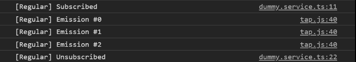
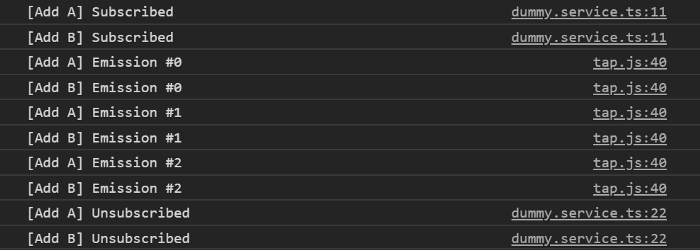
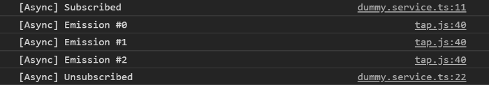
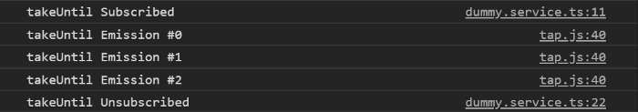
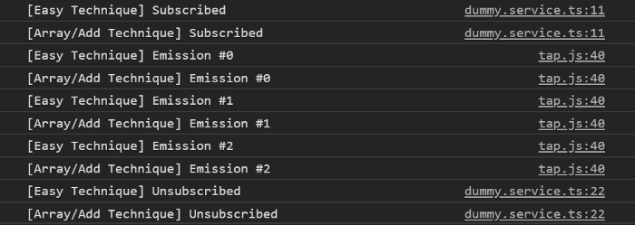
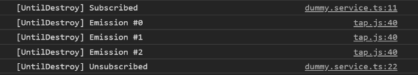

> Follow along the code with [this live demo](https://stackblitz.com/github/talohana/rxjs-angular-unsubscribe-like-a-pro)
> Find the full source code for this blog in [this github repository](https://github.com/talohana/rxjs-angular-unsubscribe-like-a-pro)

## Introduction

We use RxJS in every Angular app we write, it has a large impact on the data flow across our app, performance and much more
It is important to unsubscribe from our Observables in order to avoid memory leaks. This article will show you most of the patterns you can unsubscribe from Observables in your Angular components!
We start with creating this dummy service to help up keep track on the subscriptions we are making

```ts
@Injectable({
  providedIn: 'root',
})
export class DummyService {
  getEmissions(scope: string): Observable<string> {
    return Observable.create(observer => {
      console.log(`${scope} Subscribed`);

      const subscription: Subscription = timer(0, 1000)
        .pipe(
          map(n => `${scope} Emission #${n}`),
          tap(console.log)
        )
        .subscribe(observer);

      return () => {
        subscription.unsubscribe();
        console.log(`${scope} Unsubscribed`);
      };
    });
  }
}
```

Our dummy service will have a single getEmissions method, which accepts a scope to log events and returns an Observable which emits
\${scope} Emission #n every nth second.

## #1 The “Regular” Way

The simplest way of subscribing and unsubscribing from an Observable is to subscribe within ngOnInit, create a class property holding our Subscription, and unsubscribe within ngOnDestroy.
To make things easier, we can initialize the subscription property to Subscription.EMPTY to avoid null checking it when unsubscribing:

```ts
@Component({
  selector: 'app-regular',
  template: `<div>{{ emission }}</div>`,
})
export class RegularComponent implements OnInit, OnDestroy {
  emission: string;

  /* 
    Note: we initialize to Subscription.EMPTY to avoid null checking within ngOnDestroy
   */
  private subscription: Subscription = Subscription.EMPTY;

  constructor(private dummyService: DummyService) {}

  ngOnInit(): void {
    this.subscription = this.dummyService
      .getEmissions('Regular')
      .subscribe(emission => (this.emission = emission));
  }

  ngOnDestroy(): void {
    this.subscription.unsubscribe();
  }
}
```

To see everything’s working we’ll remove the component from the DOM after 3 seconds to see that it is unsubscribes



As the name suggests, this is the most basic way of unsubscribing,
it is good when you have a single Subscription, but when you have multiple subscriptions,
each of them will need its own class property and a call to unsubscribe within ngOnDestroy

## #2 Subscription.add method

RxJS Subscription comes with a built in Subscription.add method that allows us to stack multiple teardown logics to a single Subscription instance.
First, create class property initialized to new Subscription(),
next instead of assigning our subscriptions to class properties, call [Subscription.add](https://rxjs.dev/api/index/class/Subscription#add-) method
And finally, unsubscribe within ngOnDestroy

```ts
@Component({
  selector: 'app-add',
  template: `
    <div>{{ emissionA }}</div>
    <div>{{ emissionB }}</div>
  `,
})
export class AddComponent implements OnInit, OnDestroy {
  emissionA: string;
  emissionB: string;

  private subscription: Subscription = new Subscription();

  constructor(private dummyService: DummyService) {}

  ngOnInit(): void {
    this.subscription.add(
      this.dummyService
        .getEmissions('[Add A]')
        .subscribe(emission => (this.emissionA = emission))
    );

    this.subscription.add(
      this.dummyService
        .getEmissions('[Add B]')
        .subscribe(emission => (this.emissionB = emission))
    );
  }

  ngOnDestroy(): void {
    this.subscription.unsubscribe();
  }
}
```

Opening our console we should see two subscriptions:



With this, we can easily use the built-in power of RxJS and subscribe / unsubscribe to multiple Observables without introducing extra class properties.

## #3 AsyncPipe

Angular has many great built-in pipes, one of them is the [AsyncPipe](https://angular.io/api/common/AsyncPipe).
The AsyncPipe accepts an Observable and automatically subscribes to it and unsubscribes when the component destroyed.
Opposed to previous examples, here we are **not subscribing in our component**, but pass the Observable to AsyncPipe:

```ts
@Component({
  selector: 'app-async',
  template: `<div>{{ emissions$ | async }}</div>`,
})
export class AsyncComponent implements OnInit {
  emissions$: Observable<string>;

  constructor(private dummyService: DummyService) {}

  ngOnInit(): void {
    this.emissions$ = this.dummyService.getEmissions('[Async]');
  }
}
```



## #4 takeUntil Operator

RxJS is packed with many useful operators, [takeUntil](https://www.learnrxjs.io/learn-rxjs/operators/filtering/takeuntil) is one of them.
According to its’ signature, takeUntil accepts a notifier, which upon emission unsubscribe from the source Observable.
In our case, we would want to notify the Observable when the component destroyed, to do so we add class property called componentDestroyed
(or any other name you would like) of type `Subject<void>` and use it as a notifier.
All left to do is to “notify” within ngOnDestroy, our final code will be:

```ts
@Component({
  selector: 'app-until',
  template: `<div>{{ emission }}</div>`,
})
export class UntilComponent implements OnInit, OnDestroy {
  emission: string;

  private componentDestroyed$: Subject<void> = new Subject<void>();

  constructor(private dummyService: DummyService) {}

  ngOnInit(): void {
    this.dummyService
      .getEmissions('takeUntil')
      .pipe(takeUntil(this.componentDestroyed$))
      .subscribe(emission => (this.emission = emission));
  }

  ngOnDestroy(): void {
    this.componentDestroyed$.next();
  }
}
```



## #5 SubSink Library

[SubSink](https://github.com/wardbell/subsink) is an awesome library by [Ward Bell](https://github.com/wardbell),
it allows you to gracefully unsubscribe Observables within your component.

First, install SubSink by running

```shell
npm i subsink or yarn add subsink
```

Next we’ll create class property of type SubSink.
SubSink comes in two flavors, an Easy Technique (using a setter) and an Array/Add Technique.

Using the Easy Technique is as simple as using the sink setter method.
Using the Array/Add Technique has the same syntax as RxJS native Subscription.add.
Creating a subscription for each of the methods, our component will look like this

```ts
@Component({
  selector: 'app-sink',
  template: `
    <div>{{ easyEmission }}</div>
    <div>{{ arrayAddEmission }}</div>
  `,
})
export class SinkComponent implements OnInit, OnDestroy {
  easyEmission: string;
  arrayAddEmission: string;

  private subs = new SubSink();

  constructor(private dummyService: DummyService) {}

  ngOnInit(): void {
    /* Using the Easy Technique with a setter function */
    this.subs.sink = this.dummyService
      .getEmissions('[Easy Technique]')
      .subscribe(emission => (this.easyEmission = emission));

    /* Using the Array/Add Technique */
    this.subs.add(
      this.dummyService
        .getEmissions('[Array/Add Technique]')
        .subscribe(emission => (this.easyEmission = emission))
    );
  }

  ngOnDestroy(): void {
    this.subs.unsubscribe();
  }
}
```



## #6 until-destroy Library

> Note: this library behaves differently on Pre Ivy Angular, for more information visit the [docs](https://github.com/ngneat/until-destroy#use-with-view-engine-pre-ivy)

[until-destroy](https://github.com/ngneat/until-destroy) is one of many awesome libraries by ngneat,
it uses UntilDestroy decorator to deter which properties are subscriptions and automatically unsubscribe them when the component destroyed.
We can also use its’ custom RxJS operator named untilDestroyed instead of using class properties.

To use it we only need to apply the UntilDestroy decorator to our component, and add `untilDestroyed` operator to Observables’ pipe:

```ts
@UntilDestroy()
@Component({
  selector: 'app-destroyed',
  template: `<div>{{ emission }}</div> `,
})
export class DestroyedComponent implements OnInit {
  emission: string;

  constructor(private dummyService: DummyService) {}

  ngOnInit(): void {
    this.dummyService
      .getEmissions('[UntilDestroy]')
      .pipe(untilDestroyed(this))
      .subscribe(emission => (this.emission = emission));
  }
}
```



To conclude, until-destroy is very powerful library that allows you to automatically subscribe / unsubscribe from Observables.
In addition, until-destroy **has many features that are not described in this article**, so don’t be shy and head to their [github repo](https://github.com/ngneat/until-destroy)!

## Summary

We’ve seen a a lot of ways and patterns to subscribe and unsubscribe from our Observables,
each has it’s own pros and cons and brings a different coding style to the table.

The most important thing is, whichever pattern you choose be consistent.


